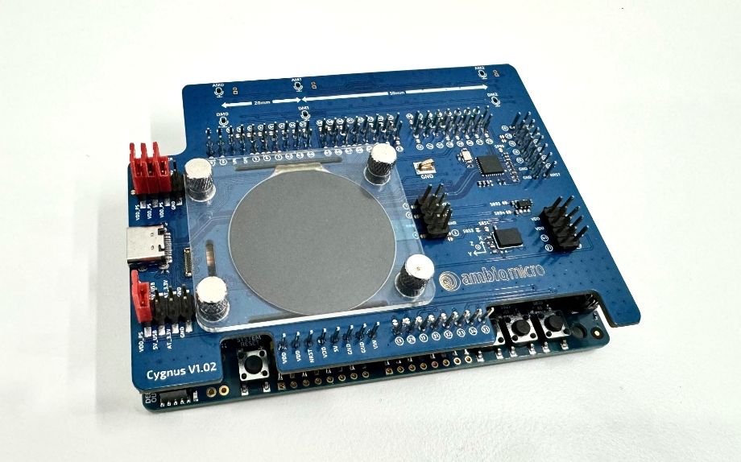

.. _apollo3p_evb_disp_shield:

Ambiq Apollo3P Display Shield
#############################

Overview
********

Apollo3 Plus display shield includes an AMOLED display with a MSPI
interface. On the shield user can find also PSRAM, additional flash memory,
analog/digital microphones and a BNO055 G-sensor.

Hardware
********

- 1.4” 360x360 Pixel SPI/QSPI AMOLED display
- 64Mb Quad-SPI single-data-rate (SDR) enabled PSRAM - APS6404L-SQ
- 16Mb Serial-SPI Nor flash - AT25FF161A
- 128Mb Quad-SPI Nor flash - MX25U12835FZNI
- 128Mb Octal-SPI Nor flash - ATXP128-CCUE
- 64Kb I2C FRAM - MB85RC64TAPNF-G-BDERE1
- 3-Axis accelerometer - BNO055

For more information about the Apollo3 Plus and Apollo3P Display Shield:

- `Apollo3 Plus Website`_
- `Apollo3 Plus Datasheet`_
- `Apollo3P Display Shield Website`_

Requirements
************

This shield can only be used with a :ref:`apollo3p_evb` board.

.. _Apollo3 Plus Website:
   https://ambiq.com/apollo3-plus/

.. _Apollo3 Plus Datasheet:
   https://contentportal.ambiq.com/documents/20123/388390/Apollo3-Blue-Plus-SoC-Datasheet.pdf

.. _Apollo3P Display Shield Website:
   https://www.ambiq.top/en/apollo3-plus-display-kit
